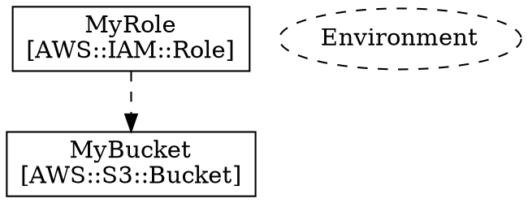

# API Reference

cfn-lint-go provides a Go library for linting CloudFormation templates.

## Packages

### pkg/lint

The main linting interface.

```go
import "github.com/lex00/cfn-lint-go/pkg/lint"
```

#### Linter

```go
// Create a new linter with default options
linter := lint.New(lint.Options{})

// Create a linter with options
linter := lint.New(lint.Options{
    Regions:     []string{"us-east-1"},
    IgnoreRules: []string{"W1001"},
})

// Lint a file
matches, err := linter.LintFile("template.yaml")

// Lint a parsed template
matches, err := linter.Lint(tmpl, "template.yaml")
```

#### Options

```go
type Options struct {
    // Regions to validate against. Empty means all regions.
    Regions []string

    // IgnoreRules is a list of rule IDs to skip.
    IgnoreRules []string

    // IncludeExperimental enables experimental rules.
    IncludeExperimental bool
}
```

#### Match

```go
type Match struct {
    Rule     string `json:"rule"`      // Rule ID (e.g., "E1001")
    Message  string `json:"message"`   // Error message
    Level    string `json:"level"`     // "error", "warning", or "info"
    Filename string `json:"filename"`  // Source file
    Line     int    `json:"line"`      // Line number
    Column   int    `json:"column"`    // Column number
}
```

### pkg/template

CloudFormation template parsing with line number tracking.

```go
import "github.com/lex00/cfn-lint-go/pkg/template"
```

#### Parsing

```go
// Parse from file
tmpl, err := template.ParseFile("template.yaml")

// Parse from bytes
tmpl, err := template.Parse([]byte(yamlContent))
```

#### Template

```go
type Template struct {
    Root                     *yaml.Node              // Raw YAML node tree
    AWSTemplateFormatVersion string
    Description              string
    Parameters               map[string]*Parameter
    Mappings                 map[string]*Mapping
    Conditions               map[string]*Condition
    Resources                map[string]*Resource
    Outputs                  map[string]*Output
    Metadata                 map[string]any
    MetadataNode             *yaml.Node              // For line number tracking
    MappingsNode             *yaml.Node
    ConditionsNode           *yaml.Node
    Filename                 string
}

// Check if resource exists
if tmpl.HasResource("MyBucket") { ... }

// Check if parameter exists
if tmpl.HasParameter("Environment") { ... }

// Get all resource names
names := tmpl.GetResourceNames()

// Get all parameter names
names := tmpl.GetParameterNames()
```

#### Resource

```go
type Resource struct {
    Node       *yaml.Node       // YAML node (for line numbers)
    Type       string           // e.g., "AWS::S3::Bucket"
    Properties map[string]any   // Decoded properties with intrinsic functions
    DependsOn  []string
    Condition  string
    Metadata   map[string]any
}
```

#### Parameter

```go
type Parameter struct {
    Node           *yaml.Node
    Type           string
    Default        any
    AllowedValues  []any
    AllowedPattern string
    MinValue       *float64
    MaxValue       *float64
    MinLength      *int
    MaxLength      *int
    Description    string
    NoEcho         bool
}
```

#### Mapping

```go
type Mapping struct {
    Node   *yaml.Node
    Values map[string]map[string]any // TopLevelKey -> SecondLevelKey -> Value
}
```

#### Condition

```go
type Condition struct {
    Node       *yaml.Node
    Expression any // The condition expression (Fn::Equals, Fn::And, etc.)
}
```

#### Output

```go
type Output struct {
    Node        *yaml.Node
    Value       any
    Description string
    Export      map[string]any
    Condition   string
}
```

### pkg/graph

DOT graph generation for resource dependencies.

```go
import "github.com/lex00/cfn-lint-go/pkg/graph"
```

#### Generator

```go
// Create generator
gen := &graph.Generator{
    IncludeParameters: true,  // Include parameter nodes
}

// Generate to writer
err := gen.Generate(tmpl, os.Stdout)

// Generate to string
dot, err := gen.GenerateString(tmpl)
```

#### Output Format



### pkg/rules

Rule interface and registry.

```go
import "github.com/lex00/cfn-lint-go/pkg/rules"
```

#### Rule Interface

```go
type Rule interface {
    ID() string
    ShortDesc() string
    Description() string
    Source() string
    Tags() []string
    Match(tmpl *template.Template) []Match
}

type Match struct {
    Message string
    Line    int
    Column  int
    Path    []string  // JSON path to the problematic element
}
```

#### Registry

```go
// Register a rule (typically in init())
rules.Register(&MyRule{})

// Get all rules
allRules := rules.All()

// Get rule by ID
rule := rules.Get("E1001")

// Count registered rules
count := rules.Count()
```

## Example Usage

### Basic Linting

```go
package main

import (
    "fmt"
    "log"

    "github.com/lex00/cfn-lint-go/pkg/lint"
)

func main() {
    linter := lint.New(lint.Options{})

    matches, err := linter.LintFile("template.yaml")
    if err != nil {
        log.Fatal(err)
    }

    for _, m := range matches {
        fmt.Printf("%s:%d:%d: [%s] %s\n",
            m.Filename, m.Line, m.Column, m.Rule, m.Message)
    }
}
```

### Generate Dependency Graph

```go
package main

import (
    "log"
    "os"

    "github.com/lex00/cfn-lint-go/pkg/graph"
    "github.com/lex00/cfn-lint-go/pkg/template"
)

func main() {
    tmpl, err := template.ParseFile("template.yaml")
    if err != nil {
        log.Fatal(err)
    }

    gen := &graph.Generator{IncludeParameters: true}
    if err := gen.Generate(tmpl, os.Stdout); err != nil {
        log.Fatal(err)
    }
}
```

### Custom Rule

```go
package myrules

import (
    "github.com/lex00/cfn-lint-go/pkg/rules"
    "github.com/lex00/cfn-lint-go/pkg/template"
)

func init() {
    rules.Register(&NoHardcodedBuckets{})
}

type NoHardcodedBuckets struct{}

func (r *NoHardcodedBuckets) ID() string          { return "C0001" }
func (r *NoHardcodedBuckets) ShortDesc() string   { return "No hardcoded bucket names" }
func (r *NoHardcodedBuckets) Description() string { return "Bucket names should use parameters or references" }
func (r *NoHardcodedBuckets) Source() string      { return "" }
func (r *NoHardcodedBuckets) Tags() []string      { return []string{"custom", "s3"} }

func (r *NoHardcodedBuckets) Match(tmpl *template.Template) []rules.Match {
    var matches []rules.Match
    for name, res := range tmpl.Resources {
        if res.Type == "AWS::S3::Bucket" {
            if bn, ok := res.Properties["BucketName"].(string); ok {
                matches = append(matches, rules.Match{
                    Message: "Hardcoded bucket name: " + bn,
                    Path:    []string{"Resources", name, "Properties", "BucketName"},
                })
            }
        }
    }
    return matches
}
```

### Accessing Intrinsic Functions

CloudFormation intrinsic functions are parsed into their long-form map representation:

```go
// Template YAML:
//   BucketName: !Ref MyParam

// Parsed as:
props := res.Properties["BucketName"]
// props = map[string]any{"Ref": "MyParam"}

// Check for Ref
if ref, ok := props.(map[string]any); ok {
    if target, ok := ref["Ref"].(string); ok {
        fmt.Println("References:", target)
    }
}
```

Supported intrinsic tags:
- `!Ref` → `{"Ref": "..."}`
- `!GetAtt` → `{"Fn::GetAtt": "..."}`
- `!Sub` → `{"Fn::Sub": "..."}`
- `!Join` → `{"Fn::Join": [...]}`
- `!Select` → `{"Fn::Select": [...]}`
- `!If` → `{"Fn::If": [...]}`
- `!Condition` → `{"Condition": "..."}`
- `!GetAZs` → `{"Fn::GetAZs": "..."}`
- `!Base64` → `{"Fn::Base64": "..."}`
- `!Cidr` → `{"Fn::Cidr": [...]}`
- `!FindInMap` → `{"Fn::FindInMap": [...]}`
- `!ImportValue` → `{"Fn::ImportValue": "..."}`
- `!Split` → `{"Fn::Split": [...]}`
- And more...
